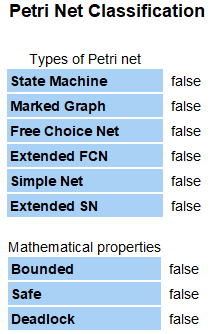

# Modelado y Simulación de CPU Dual-Core en Red de Petri y JAVA
Programación Concurrente 
Departamento de Computación
Facultad de Ciencias Exactas, Físicas y Naturales
Universidad Nacional de Córdoba
2019

Bastida, Lucas Ramiro - lucasbastidacba@gmail.com
Miranda, Noelia - naylenmiranda@gmail.com
Molina, Franco Elías - francoeliasmolina@gmail.com
Palmiotti, Mauro Agustín  - mauropalmiotti@gmail.com
## 1. Introducción

El presente trabajo tiene por objetivo el control del procesamiento de tareas que realizan los núcleos de un procesador. Como punto de  partida se tomó la red de Petri que representaba a un procesador mono núcleo y se la extendió a una red que modele un procesador con dos núcleos. A continuación se modelo dicho sistema con objetos en Java, siempre teniendo en cuenta los requerimientos exigidos para el trabajo.
 
## 2. Desarrollo

### 2.1 Problemas de concurrencia

El principal problema de concurrencia que observamos es el disparo de todas las transiciones al mismo tiempo lo que puede llevar a una inconsistencia en el marcado o a bloqueos en el sistema, esto lo evitamos mediante el uso de un monitor de concurrencia, logrando así que el disparo de las transiciones sea controlado, garantizando el buen funcionamiento del sistema. 

### 2.2 Modelado del Sistema en Red de Petri

*Figura 2.2.1. Modelo de Red de Petri para CPU de Dos Núcleos*

#### 2.2.2 Propiedades

La Red de Petri utilizada cuenta con una serie de propiedades, enunciadas a continuación:

- **Vivacidad**: Debido a que todas las transiciones de la red siempre pueden ser disparadas y esta evoluciona gracias al disparo de estas, se puede afirmar que dicha red tiene Vivacidad.
- **Seguridad**: La condición para que una Red de Petri  sea segura es que cada plaza que la compone tiene a lo sumo cero o un token. A diferencia de esto, esta red cuenta con plazas que tienen más de un token, por lo tanto, no es segura.
- **Limitación**: Una Red de Petri está limitada si todos las plazas están limitados por k, es decir que todas las plazas pueden contener a lo sumo k-token. Sin embargo, esto no ocurre en este caso, por lo que  la red no es limitada.
- **Libre de conflicto y conflictos estructurales**: Se dice que existe un conflicto estructural cuando al menos dos transiciones tienen una plaza en común. Esto se cumple en esta red, por lo que se puede afirmar que no es libre de conflictos y que tiene conflictos estructurales.
- **Libre elección**: Una red es de libre elección cuando las transiciones que participan en un conflicto tienen una sola plaza de entrada. Esto no es lo que ocurre en este caso, por lo que se puede afirmar que no tiene libre elección.
- **Simple**: La red es simple ya que las transiciones solo pueden verse afectadas por un conflicto.
- **Pura**: Una Red de Petri es pura cuando no posee auto-loop, es decir, cuando una plaza es tanto una plaza de entrada como una de salida de una transición. Como en esta red se encuentran auto-loop, se dice que es pura.
-  **Capacidad finita**: Cuando las plazas de la red están limitadas a un número máximo de tokens, se dice que tiene capacidad finita, las plazas de la red analizada pueden contener infinitos token por lo que la red no es de capacidad finita.
-  **Red de Petri No-autónomas**: Una RdP no-autónoma, como ser este caso, es aquella que está sincronizada y/o temporizada.
-  **Interbloqueo**: Se dice que esta red está libre de interbloqueo ya que no tiene deadlock, es decir alguna marca alcanzable de donde no se puede disparar ninguna transición.
-  **Persistencia**: Se dice que una Red de Petri es persistente si para cada transición se cumple que dicha transición sólo puede ser desensibilizada por su propio disparo. Consecuentemente, al no cumplirse esto en la red, no es persistente.
-  **Conservación**: Esta red cumple con esta propiedad, ya que la conservación implica que todos los tokens que se generan y consumen en la red permanecen constantes.

Realizando un análisis de propiedades por medio de la herramienta Petrinator se obtuvo:

*Figura 2.2.2.1. Propiedades* 

### 2.3 Invariantes

Los invariantes permiten caracterizar ciertas propiedades de las marcas alcanzables y de las transiciones inalterables, independientemente de la evolución de la red. Se analizaran dos tipos de invariantes a continuación:

#### 2.3.1 Invariantes de plaza o P-invariantes

Un P-invariante es una región de la red, un subconjunto de plazas, en donde el número de tokens permanece constante. Los tokens pueden moverse de una plaza a otra en la región, pero ninguno se crea ni desaparece.
Para verificar que la cantidad de marcas se mantiene constante en el grupo de plazas involucradas en
cada P-invariante, en cada disparo se compara el valor del marcado actual de plazas contenidas en un
invariante con el marcado inicial de las mismas plazas obtenida al momento de cargar la red de petri. Así el
programa verifica en cada disparo que se están cumpliendo las invariantes de plazas. 
Realizando un análisis de estos con la herramienta Petrinator obtenemos los siguiente:

*Figura-03*
 

*Figura-04.*

#### 2.3.2 Invariantes de transición o T-invariantes: 

Un T-invariante indica un posible bucle en la red, es decir, una secuencia de transiciones cuyo efecto neto es nulo, es decir que conduce de nuevo a la marca en que comienza. Para la verificación de los T-invariantes se utiliza un procedimiento similar que para los P-invariantes, es decir, cuando se dispara una transición, se verifica si esta pertenece a un T-invariante y se determina si esta se disparó en el orden secuencial correspondiente a dicho T-invariante.
Realizando el mismo análisis con Petrinator:

*Figura-05.*

Se pueden observar los siguientes T-invariantes:
- {T0, T10, T11, T12, T14, T2, T9}
- {T0, T10, T13, T2, T9}
- {T0, T1, T3, T4, T6}
- {T0, T1, T3, T4, T5, T7, T8}

### 2.4 Conflictos y Política de Resolución

Para la resolución de conflictos se utilizó la política solicitada para el trabajo, es decir, que la distribución de tareas entre los buffer sea equitativa. Para realizar esto, antes de disparar la transición que asigna los buffer se verifica la capacidad de los mismos para así determinar cuál será el buffer que reciba la tarea. En caso de que tengan la misma cantidad, las tareas se enviaran al buffer 1.

### 2.5 Modelado del Sistema con Objetos en  Java

#### 2.5.1 Diagrama de Clases

*Diagrama de clases*

#### 2.5.3 Diagrama de Secuencias

Se procedió a realizar un diagrama de secuencias para un disparo exitoso de una de las transiciones que alimenta a uno de los buffers de la CPU, mostrando el uso de la política.

*Diagrama de secuencia*

#### 2.5.4 Determinación de la cantidad de hilos:

La cantidad de hilos necesarios para la ejecución del programa fue determinada analizando los invariantes de plaza y de transiciones, de esta forma se establecieron los siguientes hilos:
Para el P-invariante compuesto por las plazas {P0 , P1}, que denota el arribo de las tareas, a la transición que las une T0 le corresponde un hilo a la transición T0. El mismo procedimiento se realizó para los segmentos {P4, P3} y {P10, P11}, los cuales denotan el procesamiento de las tareas en cada uno de los núcleos, por ende le corresponde un hilo a las transiciones T3 y T4 y otro a las transiciones T9 y T10  ya que su ejecución es secuencial. En el caso del encendido de la CPU, el segmento {P5, P7, P8} forman parte de un P-invariante, por lo tanto, las transiciones T5, T7 y T8 que conectan estas plazas reciben un hilo.  Así se pudo contabilizar la cantidad de hilos necesarios para la ejecución del programa, teniendo en cuenta que aquellas transiciones que no participan de una ejecución secuencial se le asigna un hilo propio, obteniendo que se necesitan **9 hilos**.

*Figura X.X . Modelo de Red de Petri, en rojo los hilos dado los Invariantes de Plaza, en anaranjado los hilos extras.*

#### 2.5.5 Ejecuciones

Para este programa un hilo representa una transición, con el objetivo de que estas puedan ser disparadas concurrentemente. Aquellos grupos de transiciones cuya ejecución es siempre secuencial pueden ser agrupadas por un único hilo que las maneje. 

Además, se realizaron  las siguientes ejecuciones con **1000 tareas** completadas para cada caso:

Consideraciones: Los resultados dependen del computador donde fueron realizadas principalmente debido a la cantidad de hilos utilizados (9) ya que los procesadores tienen un límite en la cantidad total de hilos que pueden ejecutarse simultáneamente.

En el caso c se considera la misma ejecución con los mismos parámetros pero con un procesador de 2 núcleos y 2 hilos por núcleo: Processor **Intel(R) Core(TM) i5-7200U CPU @ 2.50GHz, 2712 Mhz, 2 Core(s), 4 Logical Processor(s).**

Los núcleos físicos son la cantidad componentes de hardware reales. Los núcleos lógicos son el número de núcleos físicos multiplicado por el número de subprocesos que pueden ejecutarse en cada núcleo mediante el uso de hyperthreading.

 Finalmente se agregó una caso extra en donde un núcleo tiene menor tiempo de procesamiento en comparación con el tiempo de llegada de las tareas.

#### 2.5.5.1 **a)** Ambos núcleos con el mismo tiempo de “service_rate”.

*Figura X.X. Evolución de la Cantidad de Tareas Procesadas en ambos nucleos en función del tiempo. Ambos núcleos tienen un tiempo de procesamiento de 30 milisegundos y el arrival rate de las tareas es de 10 ms.*

Todas las tareas deberían llegar aproximadamente en 10 segundos debido a que son 1000 tareas con 10ms. Se puede observar la distribución equitativa de las tareas en los buffer, así como también se mantiene equitativa la cantidad de tareas procesadas por cada núcleo a causa de que ambos tienen el mismo tiempo de procesamiento. 

Duración total del programa: 15 segundos.
Tareas procesadas por el NÚCLEO 1 : 500
Tareas procesadas por el NÚCLEO 2 : 500

#### 2.5.5.2 **b)** Un núcleo con el doble de tiempo de “service_rate” que el otro

*Figura X.X .El NÚCLEO 1 tiene un tiempo de procesamiento de 30 milisegundos, en cambio el NÚCLEO 2 tiene un tiempo de procesamiento de 60 milisegundos y el arrival rate de las tareas es de 10 ms.*

En este caso se dispuso que el núcleo uno tenga el doble de tiempo de procesamiento que el núcleo dos, a causa de esto observamos nuevamente una distribución equitativa de tareas entre los buffer, pero no ocurre así con las tareas procesadas por cada núcleo. Se puede observar que el núcleo con menor tiempo lleva mayor cantidad de tareas procesadas, la tasa de cambio del buffer 2 es el doble que la tasa de cambio del buffer 1.

Duración total del programa: 25 segundos.

    • Tareas procesadas por el NÚCLEO 1 : 597 
    • Tareas procesadas por el NÚCLEO 2 : 403 

#### 2.5.5.3 **c)** Un núcleo con el triple de tiempo de “service_rate” que el otro

*Figura X.X . El NÚCLEO 1 tiene un tiempo de procesamiento de 30 milisegundos, en cambio el NÚCLEO 2 tiene un tiempo de procesamiento de 90 milisegundos y el arrival rate de las tareas es de 10 ms.*

En este último caso, en el que el tiempo de procesamiento del núcleo uno es el triple que el del núcleo dos, se sigue observando una distribución equitativa entre los buffer, pero en el caso de las tareas procesadas por cada núcleo se puede observar que no se procesan equitativamente, la tasa de cambio del buffer 2 es el triple que la tasa de cambio del buffer 1.

Duración total del programa: 34 segundos.
    • Tareas procesadas por el NÚCLEO 1 : 615
    • Tareas procesadas por el NÚCLEO 2 : 385

#### 2.5.5.4 A continuación se repetirá el mismo experimento pero utilizando un procesador diferente.

*Processor Intel(R) Core(TM) i5-7200U CPU @ 2.50GHz,2712 Mhz, 2 Core(s), 4 Logical Processor(s)*

*Plot4*

Se observa que la tasa de cambia termina siendo el triple al igual que el caso anterior pero durante un lapso de tiempo mayor. Esto viene dado por la limitación en el sistema ya que el procesador cuenta con 2 núcleos los cuales solo pueden procesar 2 hilos cada uno simultáneamente y la cantidad de hilos utilizados en nuestro caso es de 9. Una solución para minimizar el lapso de tiempo sería la utilización de una menor cantidad de hilos.

*Caso: 10 ms llegada de tareas, 5 ms de procesamiento buffer 1, 30 ms buffer 2*

*Plot5*

Se puede observar que como el núcleo 1 procesa las tareas en 5 ms. En la mayoría de las ejecuciones del programa, las 1000 tareas serán procesadas por e’l ya que estara vacia debido a que el tiempo de procesamiento es la mitad del tiempo que tardan en llegar las tareas. 

#### 2.5.6 Verificación de los invariantes

#### P-Invariantes

Cada vez que se realiza el disparo de una transición se calcula el nuevo marcado y luego se verifica el cumplimiento de los P-invariantes mediante el uso de las ecuaciones de P-Invariantes especificadas anteriormente. En caso de violar alguna ecuación el programa  imprime: “NO SE CUMPLIO UN P-INVARIANTE” en la consola y en el log. Luego tira una excepción finalizando así el programa.
Como tal mensaje no aparece en el log se concluye que se cumplen las ecuaciones de los P-Invariantes.

#### T-Invariantes

Al finalizar el programa, se verificaron los T-invariantes de la siguiente manera: se almacenaron todos los disparos en una lista y luego para cada conjunto de T-Invariantes, si la lista de disparos contiene el mismo conjunto, se procedió a borrar el conjunto de la lista. Se repitió este procedimiento hasta que la lista de disparos no contenga un conjunto de disparos que sea igual a algún conjunto de T-invariante.

#### Verificación de los T-Invariantes (resultado):

*Disparos restantes luego de remover los tinv:
Total de T-invariantes borrados: 1000*

Como la lista final de disparos queda vacía al extraerle los conjuntos de invariantes de transición o queda con un inicio de algún T-invariante,  se concluye que el programa funciona correctamente.

## 3. Conclusión

Tras la realización del presente trabajo de pudieron extraer numerosas conclusiones, se aprendió a **identificar**  los problemas de concurrencia que surgen en el dominio de poblema.
Se aprendió a razonar en un paradigma de programación distinto al de la programación secuencial, asi como explotar las ventajas del multiprocesamiento.
Se aprendió a **modelar** una solucion mediante el uso de redes de petri temporales aprovechando sus ventajas tales  como la representacion grafica, su ecuación de estados generalizada, sus invariantes, su escalabilidad, pero asi tambien se pudo evidenciar sus limitaciones como (...). 
Además de apredió a **implementar** dicho modelo, mediante el uso de programación orientada a objetos en Java, destacando las clases *Monitor, RdP e Hilos* en las cuales fué de mucha ayuda el uso de clases ya implementadas en *java.utils* para colecciones, semaforos y buffers. Cabe destacar la dificultad extra genera debuguear y testear el correcto funcionamiento de los hilos. 
Este trabajo además nos ha permitido **ampliar** el horizonte en el funcionamiento de otros tipos de sistemas, como los sistemas operativos, en particular Linux y de sus metodos de sincronizacion como SpinLocks, Semaphores, Mutexes.

## 4. Bibligrafía

- *Ecuación de estado generalizada para redes de Petri no 
autónomas y con distintos tipos de arcos. Dr. Ing. Orlando Micolini1, Geol. Marcelo Cebollada y Verdaguer1, Ing. Maximiliano Eschoyez, Ing. Luis Orlando Ventre1, Ing. Marcelo Ismael Schild.  Laboratorio de Arquitectura de Computadoras (LAC) FCEFyN  Universidad Nacional de Córdoba*.
- https://docs.oracle.com/javase/7/docs/api/

